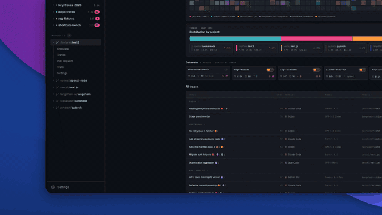

```
  █▀▀█ █▀▀█ █▀▀█ █▀▀▄ ▀█▀ █▀▀▄ █▀▀█ █▀▀▀ █▀▀█ █▀▀▀
  █  █ █  █ █▀▀▀ █  █  █  █▀▀▄ █▀▀█ █    █▀▀▀ ▀▀▀█
  ▀▀▀▀ █▀▀▀ ▀▀▀▀ ▀  ▀  ▀  ▀  ▀ ▀  ▀ ▀▀▀▀ ▀▀▀▀ ▀▀▀▀
```

<p align="center">
  <a href="https://x.com/jayfarei">
    
  </a>
</p>

<p align="center">
  <strong>opentraces hub</strong> — <a href="https://x.com/jayfarei">reach out for early access</a>
</p>

**Traces are the new source code.** opentraces is a local-first evidence layer for agent work — an open schema + CLI that captures what the agent saw, did, and changed into a private bucket, anchors those changes to the Git history that accepted them, and lets you reuse that one record many ways: search, lineage, resumable context, shareable bug reports, evals, and datasets published to Hugging Face Hub.

Every coding session leaves behind the record you actually want: the prompt that set the direction, the files the model read, the dead ends, the edits that survived, the ones that got reverted. Git keeps the diff; the rest evaporates when the session ends. opentraces keeps that record locally, anchors each change to the commit that accepted it, reconstructs what the agent saw at each step, and lets workflows project selected evidence into datasets. It works with Claude Code, Codex, and Pi today; nothing leaves your machine until you approve it.

Capture once, project many times: a bug report, a PR explanation, a resumable session, an eval row, and a dataset are all projections of the same kept record, not separate features.

> Sharing traces can leak secrets, credentials, internal paths, or customer data. opentraces reduces that risk, but it does not remove it. Read the [security docs](https://opentraces.ai/docs/security/tiers) before you publish anything.

## What It Does

1. Capture traces from supported agents (Claude Code, Codex CLI, and Pi) via session hooks and harness extensions.
2. Store capture-time evidence in a private bucket: `trace.json`, patch history, Trail events, Context Tree events, source events, and content-addressed blobs.
3. Search, map, and slice retained traces without loading full transcripts.
4. Correlate trace patches to Git history via Trace Trails: blame, graph, and track.
5. Reconstruct what the agent saw at a step via the Context Tree.
6. Sync the private bucket to a HuggingFace remote when you explicitly opt in.
7. Run local workflow skills that turn traces into schema-valid dataset rows.
8. Run named security tools over records before they leave the bucket.
9. Review dataset rows and publish approved rows to HuggingFace remotes.

## Concepts

opentraces splits every session into three linked records, each defined by the question it answers: **Trace** (what did the agent do?), **Trail** (what changed, and did it survive?), and **Ctx** (what did the model see?). Trace is the spine — every prompt, plan, read, command, and edit in order — and everything else joins back to a step on it. Each record is useful alone; the power is in the joins. The rest of the CLI is a small set of subsystems built on top of those records, and knowing the boundaries makes it predictable.

| Subsystem | What it answers / holds | Primary commands |
|-----------|-------------------------|------------------|
| **Capture** | Inbound boundary: agent hooks, the attribution watcher, optional OTLP receiver | `setup`, `init`, `capture-otlp` |
| **Bucket** | Private, local-first store of raw captured evidence (one self-sufficient unit per trace) | `status`, `bucket list` |
| **Trace** | What the agent did — the step-by-step spine, with a four-verb loop: search, pull up, dissect, extract | `trace query/get/map/slice` |
| **Trace Intelligence** | Deterministic signals about how a run went: context waste, run signals, run compare | `trace map --waste/--run-intel` |
| **Trail** | What changed and whether it survived: VCS-anchored lineage from a patch to the commit that accepted it | `trail blame/graph/track/pr` |
| **Context Tree** | What the model saw at each step (system, messages, tools, runtime state) | `ctx <trace>`, `ctx <trace>:<step>` |
| **Workflows + Datasets** | Workflow skills that project bucket traces into reviewable HF dataset rows | `workflow`, `dataset` |
| **Security** | Per-record detectors, transformers, and judges run before publication | `security`, `setup <tool>` |

A **bucket** holds raw captured traces; a **dataset** holds workflow-projected rows. They are distinct stores.

What one coding session leaves behind, layered across the substrates:

```text
opentraces <capture> · what happened between an agent and its environment

                ◄─ start ··········· session ··········· end ─►    patch trail ─►
                                                                    t+n      t+n+{}
  Git   │ attribution    HEAD ◇──────────────────────────────►  commit     ◇──◇
        │ across runs                                            └ anchor    survival
  ──────┼─────────────────────────────────────────────────────────────────────────
  Trail │ agent changes  snap▢ ····◌ patch ·······◌ patch ····▢  git_anchor_id
    ▲   │ to the env                                             trace_patch_id
  change│                                                        commit_sha · evidence
  ──────┼─────────────────────────────────────────────────────────────────────────
  Trace │ agent          ▮     ●      ●      ◍      ●      ●
        │ trajectory     user   read   read   agent  write  write
 observe│                └──────────── bash ───────────┘
    ▼   │
  ──────┼─────────────────────────────────────────────────────────────────────────
  Ctx   │ agent          ▤     ▤▤     ▤▤▤    ▤▤▤    ▤▤▤▤   ▤▤▤▤
        │ observations   (context the LLM saw, growing per step)
  ──────┼─────────────────────────────────────────────────────────────────────────
  LLM   │ ingest/produce ─────────────────────────────────────►  $ in / $$ out
```

Every session has an input side, an action timeline, and an outcome side: **Ctx** captures the input side (what the model could see at each moment), **Trace** captures the action timeline (what it planned, read, ran, and edited), and **Trail** captures the outcome side (which edits were produced, which commits accepted them, and which survived). Changes flow up to the Trail and are anchored to the commits that accepted them; observations flow down to the Context Tree as what the model actually saw.

## Pipeline

Capture sources write into the local bucket; workflows project bucket traces into reviewable rows; approved rows publish to HuggingFace remotes. Everything above the dashed line is local; everything below is opt-in remote.

```text
opentraces <pipeline> · traces become datasets

   capture sources       bucket (local)          workflow           dataset
  ┌────────────┐        ┌──────────────┐      ┌───────────┐      ┌───────────┐
  │ OT watcher │↻       │ manifest.json│      │ search API│      │ ▤▤▤▤▤▤▤▤▤ │
  │ agent hooks│─write─►│ traces/v1/   │◄────►│ security  │─run─►│ ✓ approve │
  │ OTel       │↻       │ blobs/v1/    │search│ custom    │ sync │ ✗ reject  │
  └────────────┘        │ events/v1/   │ sync └───────────┘      └───────────┘
        │ git           └──────┬───────┘            │                  │
        └── attribute ─────────┘                    │                  │
  ╌╌╌╌╌╌╌╌╌╌╌╌╌╌╌╌ sync ╌╌╌╌╌╌ │ ╌╌╌╌╌ run ╌╌╌╌╌╌╌╌ │ ╌╌╌╌ push ╌╌╌╌╌╌ │ ╌╌  local
                               ▼                      ▼                  ▼    remote
                         HF bucket ──────────►   ML Intern   ◄──── HF Hub dataset
                                                     └─ eval / training / scoring ─┘
```

## Consumers

Traces are not only logs. Once capture keeps nothing lost and the pipeline makes that evidence searchable, secure, and shareable, *consumers* are what you build on top. A consumer is a small workflow that filters and projects bucket traces, plus a renderer that puts the result somewhere useful. Training data is one destination, not the only one.

```text
opentraces <consumers> · traces become more than logs

  retained evidence                       proof-of-value clients
  ┌──────────────────┐                    ┌──────────────────────────────┐
  │ Trace  ▮ ● ● ◍   │ Skills · CLI · SDK │ Capsule    usage episodes    │
  │ Ctx    ▤ ▤ ▤     │──── read ────────► │ Skill Eval verifier factory  │
  │ Trail  ◌─◌─◌     │─── render ───────► │ Standup    yesterday rebuilt │
  │ Bucket  ▢        │                    │ Spotlight  search traces     │
  └──────────────────┘                    │ Alerts     standing reports  │
                                          │ Intent PR  why + the how     │
                                          └──────────────────────────────┘
```

Six examples, from shipped commands to prototypes:

| Consumer | What it is | Built on |
|----------|------------|----------|
| **Trace Capsule** | Share a usage episode with a third party, attaching the real agent experience to a GitHub issue rather than just a summary of the bug | security + sharing infra |
| **Skill Evaluation** | A per-skill **rubric verifier** that turns "was this skill used *effectively*?" into a reward signal for SkillOpt. The agent proposes a rubric, the factory scores it mechanically against bounded evidence, a human approves promotion. Honest by design: returns `blocked_*` until trustworthy labels exist, never a fake green | `skill-verifier`, `workflow skill-intelligence` |
| **Standup** | A daily report reconstructed from yesterday's sessions: what was attempted, what landed, what failed, and what is still open | bucket traces, narrative render |
| **Spotlight** | Fast search across your traces for relevant context mid-session, outside the active loop, or for a handoff | `trace query` |
| **Alerts** | Standing alerts and reports over trace usage: failure rate, context waste, third-party tools, secrets, policy violations | workflows |
| **Intent Pull Request** | Walk a PR's commits back to the originating sessions and compile a context pack of the "why" alongside the "how" | `trail pr` |

The pattern is always the same: filter and project retained evidence with a workflow, then render to one destination. New consumers (Slack, dashboards, CI gates) are a new workflow plus a new renderer, not a new subsystem.

## Install

Preferred end-user install:

```bash
pipx install opentraces
```

Homebrew:

```bash
brew install JayFarei/opentraces/opentraces
```

skills.sh (installs the opentraces skill so your coding agent can drive the workflow):

```bash
npx skills add jayfarei/opentraces
```

From source:

```bash
git clone https://github.com/JayFarei/opentraces
cd opentraces
python3 -m venv .venv
source .venv/bin/activate
pip install -e packages/opentraces-schema
pip install -e ".[dev]"
```

Use plain `pip install opentraces` only in CI or disposable environments.

### Uninstalling

`opentraces uninstall` is the symmetric inverse of `setup` — one command that reverses the whole multi-surface install (capture hooks for Claude Code / Codex / Pi, the OTLP receiver + its `~/.claude/settings.json` env keys, the watcher daemon, the skill, shell completions, per-repo git post-commit hooks, and security-tool flags) and stops every opentraces process. It is a root peer of `setup`, alongside `opentraces upgrade`, and is **data-safe by default** (the old `setup uninstall` spelling still works, hidden-but-callable):

```bash
opentraces uninstall --dry-run   # recommended first run: prints the plan, changes nothing
opentraces uninstall             # default: reverse every install-time patch + daemon, PRESERVE all captured data
```

The default (`--integrations-only`) tier preserves every captured trace, dataset, bucket, and Git ref (`refs/opentraces/*`, `refs/notes/opentraces`). After it, no opentraces process runs and no shared file references opentraces, but your data survives — you can re-`setup` later and pick up where you left off.

```bash
opentraces uninstall --purge     # ALSO delete captured data + git refs (UNRECOVERABLE; typed confirmation)
opentraces uninstall --project . --purge   # scope per-repo reversal/ref-purge to one repo
```

`--purge` additionally deletes the captured corpus (bucket, datasets, projects, staging) and the opentraces Git refs. This is **unrecoverable** — it deletes both the canonical Trail event log (`refs/opentraces/local/events/v1`) and its only local replay source (the bucket) — so it requires a typed confirmation (`--yes` to skip, required for non-interactive use). A configured remote bucket is local-only teardown's blind spot: it is **not** deleted and is reported in the residue summary.

The opentraces package itself is never self-uninstalled; the correct command for your install method (`pipx uninstall opentraces`, `brew uninstall jayfarei/opentraces/opentraces`, or `pip uninstall opentraces`) is printed. Your HuggingFace login (`~/.cache/huggingface/token`) is never touched.

## Quick Start

opentraces has a two-phase bootstrap: `setup` wires the machine once, `init` wires each repo.

```bash
# one-time machine setup — interactive wizard over every integration
# (capture hooks, attribution watcher, HF login, optional security tools)
opentraces setup

# initialize this repo (agent enrollment + committable marker)
opentraces init

# search retained trace evidence
opentraces trace query --lex "bug fix failing test"
opentraces trace query --skill opentraces --json

# extract bounded trace slices for dataset rows
opentraces trace slice <trace-id> --template bursts --json

# walk Git-anchored trace lineage
opentraces trail track <trace-id>

# inspect or sync the private bucket of captured traces
opentraces status
opentraces bucket sync push

# create and run a workflow-backed local dataset
opentraces dataset new bug-fixes --workflow ./workflows/bug-fix-curator/WORKFLOW.md
opentraces dataset run bug-fixes --dry-run --limit 5

# or create a skill-episode dataset from observed skill usage
opentraces dataset new opentraces-episodes --from-skill opentraces
opentraces dataset run opentraces-episodes --executor script --json

# publish reviewed dataset rows when a remote is bound
opentraces dataset publish bug-fixes --check-only
```

`init` writes the committable marker at `.opentraces.json`. Captured traces, bucket state, and upload bookkeeping stay machine-local under `~/.opentraces/`.

`opentraces doctor` checks auth, integrations, and pipeline health at any time, and flags an available CLI upgrade or integration version drift with the exact `opentraces upgrade` command to run.

## Capture

`opentraces setup` runs an interactive wizard; each integration is also a direct subcommand:

- `setup claude-code` / `setup codex-cli` install session-capture hooks. `setup pi` checks or writes the Pi package entry; the primary package path is `pi install npm:opentraces-pi`. Capture is opt-out: under global tracking (the default) every agent including Pi auto-enrolls each repo on first capture, private + review-required. Opt out with `opentraces config tracking-mode manual` or a per-project `excluded` marker; `opentraces init --agent <name>` still enrolls a repo explicitly. (Codex Desktop is not covered.)
- `setup git` installs a post-commit hook that correlates each commit to the trace that produced it (via `refs/notes/opentraces`), powering `trail blame`.
- `setup watcher` installs a background **attribution watcher** (launchd on macOS, systemd `--user` on Linux; offered by default in the wizard). On an interval it walks enlisted projects, observes filesystem mutations as a backstop for writes hooks miss, reconciles them against open step windows, and matures Trace Trails over time. The watcher is polling-based today; a real-time (inotify/watchdog) observer that would narrow attribution windows is deferred. Subcommands: `install/start/stop/status/tick`.
- `setup capture-otlp` patches `~/.claude/settings.json` so Claude Code emits OpenTelemetry, enabling the higher-fidelity Context Tree capture source. Control the receiver with `capture-otlp start/stop/restart/status/flush`.
- `setup skill` installs the shared agent skill into Claude Code, Codex CLI, and Pi harness skill directories.
- In Pi, the package exposes `/ot-capture-status`, `/ot-setup`, `/ot-search <query>`, `/ot-trace <trace-id>`, `/ot-standup`, `/ot-capsule [trace-id]`, and `/ot-dataset`. Use `/ot-search` to find candidates in the local/private bucket, then `/ot-trace` to load one trace's tool evidence.
- `auth login` logs in to HuggingFace for dataset and bucket remotes.
- `opentraces upgrade` (a root peer of `setup`; the old `setup upgrade` spelling still works, hidden-but-callable) upgrades the whole stack: it upgrades the CLI via the detected install method (pipx/brew/pip; a source/editable install skips the package upgrade and refreshes glue + skill), re-renders all installed integration glue (watcher shim, git post-commit hook, claude-code & codex-cli hooks, OTLP settings + autostart) re-stamped to the new version, and refreshes the project skill file. Use `opentraces upgrade --integrations-only` to re-render already-installed glue to the current CLI version without a CLI bump, or `--skill-only` to refresh just the skill file and hook.

## Trace

The trace surface returns bounded projections over a local lexical + concept Trace Index (BM25 plus a bounded concept join, not embeddings), so you can search and slice without loading full transcripts.

The visible trace surface is a four-verb loop: query (search) → get (pull up) → map (dissect) → slice (extract).

- `trace query` returns bounded candidate packets; pass `--skill <name>` to rank observed skills by snapshot-backed invocation usage (folds in the former `trace skills`). `trace map` returns a deterministic Trace Map. `trace get` resolves a trace, trace unit, map node, or `ot://` Trail resource, and also resolves `<id>:<step>` / `<id>:last` / `<id>:A-B` addresses.
- `trace slice <trace-id> --template bursts` materializes one deterministic slice per detected change burst. Manual `--from-step/--to-step`, `--around-step`, and `--around-patch` windows are available when a workflow needs an explicit range. A Trace Slice is context for audit and later dataset projection, not a training datum by itself.
- `trace slice <trace-id> --by user-turn|change-burst|milestone|subgoal --json` runs the Trace Slicer Library: one operation `slice(trace, slicer) -> Trajectory[]` that decomposes a session into a tiling array of trajectories (`opentraces.slicing.v1`). `user-turn` and `change-burst` are deterministic; `milestone` and `subgoal` are cheap-LLM, resolved by a pluggable judge (default `agent`: needs-judgment exits `rc=10` with structured `JudgmentRequest`s, you answer and re-run with `--answers <file>` for the final tiling at `rc=0`). Derive-on-demand; no schema bump. This absorbs the former `trace partition <ref> --by s1|s2|s3|s4` (hidden-but-callable, same engine).
- `trace query`/`trace map`/`trace get` are read-only, derive-on-demand projections — they never persist and never bump `SCHEMA_VERSION`. A few narrower verbs (`trace compare`, `trace index`, `trace teleport`) are now hidden-but-callable behind the four-verb surface; `trace index` still self-maintains the local search snapshot on demand.

A *trace patch* is one Edit/Write tool call (roughly one hunk on one file). A *change burst* clusters nearby patches by step proximity.

## Trace Intelligence

Deterministic, derive-on-demand signals about how a run actually went, sitting on top of the Trace surface. No LLM, no schema change, nothing persisted: each is computed on read and emitted as a frozen JSON envelope. Three capabilities:

- **Context waste** — `trace map <trace-id> --waste` (or `trace get <trace-id> --waste`) emits `opentraces.context_waste.v2`: oversized tool outputs (>= 12000 chars), the same file read 3+ times in 20 minutes, and search commands repeated 5+ times in 10 minutes.
- **Run signals** — `trace map <trace-id> --run-intel` (or `trace get <trace-id> --run-intel`) emits `opentraces.run_intel.v1`: deterministic `resteer` / `recovery` / `loop` / `failure` annotations. Recovery only fires after an uncleared failure; failure prefers structured tool errors over substring guesses; a repeated command is one `loop` signal carrying `evidence.repeat_count`; a one-word approval never reads as a correction.
- **Run compare** — `trace compare <trace-a> <trace-b>` (hidden-but-callable) emits `opentraces.trace_compare.v1`: per-side fidelity plus `{a, b, delta}` triples over token/cost metrics, deterministic quality persona scores, and burst/error/security signals, with both traces pinned to the same burst gap so the deltas are comparable.

Each detector derives from the `TraceRecord` and reports a `fidelity` of `record` or `otel`, preferring full wire fidelity when the trace was captured via the OTLP receiver.

## Trail

Trace Trails are the evidence chain from a trace step to the Git history that accepted its patch. The substrate is VCS-anchored lineage: append-only `TrailEvent` batches under `refs/opentraces/local/events/v1`, plus rebuildable projections (CLI explanations, doctor checks, search/dataset views).

Visible commands:

- `trail blame commit <sha>` attributes a commit's lines back to the traces that authored them. `trail pr render | create | update` (lifted to a top-level `trail` verb; the old `trail blame pr ...` spelling still works, hidden-but-callable) projects that blame across a branch range into a GitHub PR body (deterministic synthesis, no LLM) and wraps `gh` for idempotent create-or-update.
- `trail graph` renders commit + trace history.
- `trail track <trace-id>` walks a trace's lineage through Git history and reports `HEAD` survival. Pass `--patch`/`--anchor` to track one patch or anchor, `--since`/`--all` for batch JSONL, and `--history-limit N` to bound the per-anchor walk.

Survival states reported per anchor: `alive_on_path`, `alive_transformed`, `alive_moved`, `partially_preserved`, `repaired`, `reverted`, `lost`, `unknown`. Anchor identity is tiered: an exact range hash first, then a structural (line-similarity) fallback, so identity survives format-then-commit pipelines (firmness drops `firm` → `provisional`). Substrate commands (`explain`, `sync`, `timeline`, `resolve`, `attach`, `rebuild`, `diff`, `resume`, `snapshots`) remain callable for scripting and debugging but are hidden from `--help`. See the [Trace Trails docs](https://opentraces.ai/docs/workflow/blame) for the full model.

## Context Tree

The Context Tree captures what the LLM actually saw at each step of a session: `system`, `messages`, `tool_registry`, and `runtime_state` layers, content-addressed and joined to the trace via `Step.context_node_id` and `TraceRecord.context_tree_summary`.

`opentraces ctx <trace-id>` prints a bounded overview card; `opentraces ctx <trace-id>:<step>` (or `:last`) resolves the model input at one step, and `--layer system|messages|tools|runtime` narrows to one layer. This bare-noun address form supersedes the old `ctx tree/show/step/reads/writes/diff/compactions/prune/resume/resolve/anchor-for-step` subcommands, which stay callable but are hidden from `--help`.

Two capture sources feed the same substrate. The JSONL parser (harness-side) ships shared session-level layers per node — walk-back to "what did the LLM see at step 7" is a session-level approximation in that path. The OTLP receiver (`setup capture-otlp`) closes the assembled-system-prompt, tool-schema, and sampling-params gaps for sessions captured over OpenTelemetry. The watcher auto-flushes live OTel sessions into the bucket once they go idle (zero-touch), and `capture-otlp flush --from-raw-bodies --session <id> --project <repo> --trace-id <id>` reconstructs an already-captured OTel session per-step (one node per llm-request) straight from the raw bodies — no live receiver — lands the nodes in the bucket, and joins them to the trace spine so `ctx show` / `ctx step` can read them. See the [Context Tree docs](https://opentraces.ai/docs/workflow/context-tree).

## Bucket

Every captured trace lands in a local-first private bucket under `~/.opentraces/bucket/`: a per-trace envelope (`trace.json` plus gzip-deterministic Trail/context/source companions), content-addressed blobs, a canonical event-log mirror, and a top-level manifest. The bucket is the self-sufficient unit — read verbs accept `--remote <hf-repo>` for symmetric local/remote access.

- `opentraces status` is the O(1) fleet safety dashboard: scanned/unscanned counts and a "safe to sync" verdict that is structurally impossible while any trace is unscanned (`--short`/`--full`/`--project SLUG`). `bucket list` is the bounded, paginated per-trace inventory (supersedes the old O(N) `bucket manifest` hang; `--count`/`--limit`/`--cursor`/facet filters). `bucket verify`, `bucket repair`, `bucket reclaim` inspect and maintain the local bucket; `bucket repair` also covers the former `bucket manifest --heal` and `bucket rebuild`. The older `bucket status`, `bucket manifest`, `bucket rebuild`, `bucket prune`, `bucket prefetch` spellings still work, hidden-but-callable.
- `bucket connect` (formerly `setup bucket`) opts into remote-by-default sync against a private (S3-backed) HuggingFace bucket remote, reusing existing HF auth. Run `opentraces auth login` first; without it `bucket connect` exits with a `run 'opentraces auth login'` hint. The wizard also prompts for a bucket security policy (recommended / basic / strict / off / custom) before configuring remote sync.
- `bucket security` is a command group that controls how raw captured evidence is protected before it syncs to the private bucket. `bucket security status` is a read-only posture inspector (filtered / unfiltered / version-stale counts plus the exact remediation); `bucket security policy --policy recommended` (also `basic`, `strict`, `off`) applies a named bundle; `bucket security policy --tool regex --enable` / `--tool entropy --disable` edits one tool at a time; `bucket security run [--all | --trace <id>]` applies the configured filter to existing records so they become remote-sync eligible. A policy is just a named bundle over the same `cfg.security.<tool>.enabled` flags that `setup <tool>` and `config set security.<tool>.enabled` flip. Policy bundles: `off` (nothing), `basic` (regex, entropy), `recommended` (regex, entropy, business_logic, path_anonymizer, classifier), `strict` (regex, entropy, trufflehog, privacy_filter, business_logic, path_anonymizer, classifier).
- `bucket sync push/pull/diff/status` syncs (push order: blobs → events → envelopes → manifest); `bucket sync push` is the gated egress seal — it emits an auditable `pushed[]`/`withheld[]` partition and refuses (zero bytes, non-zero exit) if any trace is not cleared for sync (`--dry-run` previews the partition). `bucket replay --repo` reconstructs the canonical Git event ref byte-identically. The old `bucket remote push/pull/diff/status` spellings still work, hidden-but-callable.

## Workflows and Datasets

A dataset is a workflow-driven row projection over one or more bucket traces.

- `workflow create/list/templates/remove` manages local dataset workflow skill packages. The bundled `skill-command-trajectory-eval-v1` template is materialized with `workflow create <workflow-name> --template skill-command-trajectory-eval-v1`.
- `dataset new <name> --workflow <path>` resolves the workflow and creates the manifest — an unresolvable `--workflow` now exits `rc=2` rather than binding an opaque `sha256:unconfigured` placeholder digest; `dataset new <name> --from-skill <skill>` binds the built-in `skill-episodes-v1` workflow to a snapshot-backed skill query; `dataset run` executes the workflow (`--executor current-agent|script`, dry-run, `--sync` for a watermark-cursored delta re-run, `--answers <file>` to resume past a needs-judgment `rc=10`); `dataset verify` replays the bound workflow against the bucket and classifies the result as reproduces / bucket-advanced / integrity-failure; `dataset review/approve/reject` controls per-row publication state; `dataset remote create` binds a HuggingFace dataset remote; `dataset publish` ships approved rows through the shared egress clearance gate; `dataset schedule` controls recurring runs; `dataset status/list/remove` round out the surface.
- `workflow optimize` runs the SkillOpt skill optimizer (arXiv 2605.23904): the bundled `skill-opt-v1` workflow projects captured traces into scored-rollout rows (a real outcome reward from `outcome.success`/`committed`/Trail survival), then a propose-and-rank loop applies bounded `add/delete/replace` edits to a skill, accepting only edits that strictly improve a held-out gate (`--proposer default|llm`, `--budget`, `--schedule`, `--epochs`). It writes `best_skill.md` + an `edit_apply_report.json` audit; without `--dry-run` it promotes the winning skill to a versioned managed location and records skill-version lineage. The held-out gate can re-roll a candidate skill on a live agent (the consumer's re-rollout runner); the offline default scores against the reward-weighted failure modes of captured traces.
- `skill-verifier status/autoverify/align/score` is the trace-grounded reward that SkillOpt optimizes against. `workflow skill-intelligence` mines bucket traces into per-skill episodes; `skill-verifier` builds a weighted-criteria **rubric** over that evidence (each criterion judged `deterministic` / `agent` / `human`) and calibrates it. The trust ladder is mechanical, never author-set: `blocked_<reason>` → `provisional_weak_only` → `calibrated`, where self-judged signal can never exceed provisional and `calibrated` always requires real human gold. On the current near-one-class bucket every seed skill correctly returns `blocked_*` — that is the honest answer, not an unfinished feature; the bottleneck is trustworthy labels, not the framework. The public verifier candidate workflow template lives in `src/opentraces/workflow_templates/skill-verifier-candidates-v1/`.

## Security

The security pipeline is versioned independently from the CLI and schema (currently `SECURITY_VERSION = 0.8.0`). The contract is deliberately simple: all per-record security tools default off, and workflows opt into the named tools they need.

| Tool | Kind | Default | What it does |
|------|------|---------|--------------|
| `regex` | detector | off | Built-in token/key pattern detectors |
| `entropy` | detector | off | High-entropy secret-like strings |
| `trufflehog` | detector | off | Optional deep secret detector, configured with `opentraces setup trufflehog` |
| `privacy_filter` | detector | off | Optional local/HF NER PII detector, configured with `opentraces setup privacy-filter` |
| `llm_pii` | detector | off | Advanced per-field LLM PII detector, configured directly |
| `business_logic` | detector | off | Redactable spans for internal hostnames, URLs, DB connection strings, and AWS account ids |
| `path_anonymizer` | transformer | off | Rewrites local usernames in filesystem paths |
| `capsule_scope` | transformer | off | Field-path exclusion for prompt-bearing capsule content |
| `classifier` | judge | off | Heuristic sensitivity verdict without mutating content |

Run `opentraces security tools list` to see the active config, and pipe JSON through `opentraces security sanitize --tools regex,entropy` when a workflow wants explicit sanitization. `--use-config` runs only tools you have enabled. Session-level LLM review (`opentraces dataset review`) is a separate, on-demand publication gate, not a per-record tool. `0.8.0` adds ctx/trail-aware companion sanitization (`sanitize_companion_dict`), which walks a Context Tree / Trail companion dict leaf-by-leaf at its own field type instead of scanning it as one opaque blob.

Bucket security protects raw captured traces before they sync to the private bucket. `opentraces bucket security policy --policy recommended` (also `basic`, `strict`, `off`) applies a named bundle of these same tools; `opentraces bucket security policy --tool regex --enable` edits one tool at a time; `opentraces bucket security status` is the read-only inspector and names the exact remediation; `opentraces bucket security run --all` applies the configured filter to existing records. The `--policy` flag accepts only `off|basic|recommended|strict`. A bucket policy is a named bundle over the same `cfg.security.<tool>.enabled` flags shown above, while `security tools list|info` and `security sanitize` stay the generic registry surface. Dataset-row publication security is covered separately.

See [security tools](https://opentraces.ai/docs/security/tiers) and [scanning details](https://opentraces.ai/docs/security/scanning).

## Schema

The trace format lives in [`packages/opentraces-schema/`](packages/opentraces-schema/). Each JSONL line is one `TraceRecord`, with:

- task and agent identity
- TAO-loop steps
- tool calls and observations
- token and cost metrics
- outcome signals
- security metadata
- optional attribution and commit correlation data

The schema is a superset of ATIF and borrows ideas from Agent Trace, ADP, and OTel GenAI. Current schema version: `0.9.0`. `TraceRecord` is the spine; `Step.context_node_id` and `TraceRecord.context_tree_summary` are the Context Tree join keys, and `TraceRecord.patches[]` is the authoritative output set. `Outcome.patch` was removed; clients assemble diffs from `patches[]` and the trace's `trail.jsonl.gz`. `0.7.0` added the additive dataset security policy contract (`DatasetManifest.security`). `0.8.0` (the seal-family train's one schema change, MINOR) adds purely additive `Environment` fields for a future dependency-pin resolver, `resolved_dependencies`, `interpreter`, `arch`, `platform`, `abi_tag`, all optional and absent by default; the `TraceRecord` wire shape is otherwise unchanged from `0.6.0`. `0.9.0` (issue #212, MINOR) adds purely additive dataset-lifecycle facet fields for `dataset run --facet` metadata scoping, `DatasetCandidateQuery.facets` and `DatasetRunRecord.facet_resolution`, both optional; `TraceRecord` is untouched.

## Tell Your Agent

Paste this into your coding agent:

~~~
Set up opentraces on this machine for agent trace collection.

Work through this as an interview: at each decision point below, ASK ME the question, show me the options, and WAIT for my answer before doing anything. If your interface has a structured way to ask multiple-choice questions, use it; otherwise just ask in chat. Do not assume defaults without confirming.

Step 1 - Install or update:
Check if `opentraces --version` works.
If not installed, run: pipx install opentraces
If already installed, run: opentraces upgrade

Step 2 - Choose tracking mode:
Ask: "How should opentraces track your projects?"
- Global (recommended): auto-enroll Claude/Codex projects when capture fires.
- Manual: only projects where I explicitly run `opentraces init` are tracked.
Pi is extension-backed and still requires explicit per-project `opentraces init --agent pi` consent before sidecars are written.
Apply with: `opentraces config tracking-mode global` or `opentraces config tracking-mode manual`

Step 3 - Install capture hooks and the shared skill:
Ask which agents to connect for capture hooks.
- Claude Code: `opentraces setup claude-code`
- Codex CLI: `opentraces setup codex-cli`
- Pi: first `pi install npm:opentraces-pi`, then `opentraces setup pi --dry-run --json` or use `/ot-setup` inside Pi.
Then ask: "Install the shared opentraces skill so supported agents can drive the CLI?"
- Yes, recommended: run `opentraces setup skill`. Use `--harness claude-code`, `--harness codex-cli`, or `--harness pi` only if I want to limit the skill to one harness.
- No: skip the skill install; capture hooks can still run, but agents may not see the opentraces command reference automatically.
Also run `opentraces setup git` for post-commit Trace Trails.
Before installing a selected agent hook, check that agent's own CLI is installed and authenticated enough to start a session:
- Claude Code: `command -v claude`; if missing or logged out, tell me to run `claude login` outside this session.
- Codex CLI: `command -v codex`; if missing or logged out, tell me to run `codex login` outside this session. This does not cover Codex Desktop.
- Pi: `command -v pi`; if missing or logged out, tell me to run `pi /login` outside this session before using Pi capture.
Codex hooks are observational; they must not approve or deny permission prompts. Pi setup manages package resources only; it does not silently install Python, start services, authenticate, or enable capture.
After installing hooks or the shared skill, tell me to start a new Claude Code, Codex CLI, or Pi session before expecting capture hooks or the opentraces skill to be available in that agent. Do not ask for a machine reboot; a fresh agent session is enough.

Step 4 - Authenticate:
Run `opentraces --json auth whoami` and inspect the JSON.
If already authenticated, continue.
If unauthenticated, ask whether to connect HuggingFace now or skip. Auth is needed for bucket sync and dataset remotes; local capture works offline.
- Browser/device flow: only run `opentraces auth login --device-timeout 180` if I can open the shown URL and enter the code while you wait. When the URL and code appear, clearly tell me: "Open the URL, enter the code, then come back here; this command is waiting." If it times out, stop and show the outside-session steps below.
- Outside this session: tell me to run `opentraces auth login` in a normal terminal, or `opentraces auth login --token` for a personal token, or export `HF_TOKEN=hf_...`; then rerun `opentraces --json auth whoami`.
- Skip for now: continue local-only and do not run `opentraces bucket connect --remote`.
Do not ask me to paste an HF token into agent chat.

Step 5 - Initialize a project when needed:
If tracking mode is global, the project auto-enrolls on first capture. To enroll explicitly:
`opentraces init --agent claude-code --import-existing`
`opentraces init --agent codex-cli`
`opentraces init --agent pi`
Codex and Pi capture start with future sessions after setup and init. `--import-existing` is a Claude Code backfill path, not a Codex/Pi backfill path.

Step 6 - Optional bucket sync:
Ask whether to configure private bucket sync. If yes:
`opentraces bucket connect`
`opentraces bucket sync status`
Only run this after `opentraces --json auth whoami` reports authenticated. If auth is still missing, clearly say: "Bucket sync needs HuggingFace auth; run `opentraces auth login` outside this session, then rerun setup."

Step 7 - Optional security tools:
Ask: "Enable any extra security tools? All per-record tools are optional and default off."
- TruffleHog: `opentraces setup trufflehog`
- Privacy-filter NER: `opentraces setup privacy-filter`
- LLM review for dataset publication: handled at review time via `opentraces dataset review` / `opentraces dataset publish` (the old `opentraces setup llm-review` spelling still works, hidden-but-callable)
For explicit workflow sanitization, use `opentraces security sanitize --tools regex,entropy,path_anonymizer` or `--use-config`.
Then run `opentraces doctor` and `opentraces security tools list`.

Once set up, read the skill at `~/.agents/skills/opentraces/SKILL.md` (or `.agents/skills/opentraces/SKILL.md` inside an initialized project) for the full command reference and workflows.

Working with retained traces:
- `opentraces status` is the fleet bucket safety dashboard (scanned/unscanned counts, safe-to-sync verdict)
- `opentraces bucket list` inspects the private bucket's per-trace inventory
- `opentraces bucket repair --json` refreshes derived bucket projections
- `opentraces trace query` searches retained traces
- `opentraces trace query --skill <name> --json` ranks observed skills by invocation usage
- `opentraces trace map <id> --bursts` renders deterministic edit/intent bursts
- `opentraces trace slice <id> --template bursts` creates workflow packets
- `opentraces trace get <id>` resolves a trace, unit, or ot:// resource

Trace Trails:
- `opentraces trail blame commit <sha>` resolves a commit to contributing traces
- `opentraces trail blame commit <sha> <path> --lines` scopes blame to one file
- `opentraces trail pr render` renders a PR body from branch lineage
- `opentraces trail graph` renders commit + trace history
- `opentraces trail track <trace-id>` walks a trace's lineage through Git

Context Tree:
- `opentraces ctx <trace-id>` prints what the agent saw across the trace
- `opentraces ctx <trace-id>:<step-index>` resolves one step's context
- `opentraces ctx <trace-id>:<step-index> --layer messages` narrows to one layer
- `opentraces setup capture-otlp` enables higher-fidelity Claude Code context capture

Dataset workflows and datasets:
- `opentraces workflow templates` lists row-projection templates
- `opentraces workflow create my-workflow --template skill-command-trajectory-eval-v1`
- `opentraces dataset new my-set --workflow ./workflows/my-workflow/`
- `opentraces dataset run my-set` fills it with workflow-projected rows
- `opentraces dataset new my-skill-set --from-skill opentraces`
- `opentraces dataset run my-skill-set --executor script --json`
- `opentraces dataset review my-set --json` lists rows
- `opentraces dataset review approve my-set <row-id>` approves one row
- `opentraces dataset remote create my-set <owner>/<repo> --private`
- `opentraces dataset publish my-set` publishes approved rows only
~~~

## Docs

| Section | Link |
|---------|------|
| Installation | https://opentraces.ai/docs/getting-started/installation |
| Authentication | https://opentraces.ai/docs/getting-started/authentication |
| Quick Start | https://opentraces.ai/docs/getting-started/quickstart |
| Commands | https://opentraces.ai/docs/cli/commands |
| Supported Agents | https://opentraces.ai/docs/cli/supported-agents |
| Troubleshooting | https://opentraces.ai/docs/cli/troubleshooting |
| Security Tools | https://opentraces.ai/docs/security/tiers |
| Security Configuration | https://opentraces.ai/docs/security/configuration |
| Security Scanning | https://opentraces.ai/docs/security/scanning |
| Schema Overview | https://opentraces.ai/docs/schema/overview |
| Schema: TraceRecord | https://opentraces.ai/docs/schema/trace-record |
| Schema: Steps | https://opentraces.ai/docs/schema/steps |
| Outcome & Attribution | https://opentraces.ai/docs/schema/outcome-attribution |
| Schema Versioning | https://opentraces.ai/docs/schema/versioning |
| Parsing | https://opentraces.ai/docs/workflow/parsing |
| Dataset Row Review | https://opentraces.ai/docs/workflow/review |
| Publish | https://opentraces.ai/docs/workflow/pushing |
| Trace Trails | https://opentraces.ai/docs/workflow/blame |
| Portable Bucket | https://opentraces.ai/docs/workflow/bucket |
| Context Tree | https://opentraces.ai/docs/workflow/context-tree |
| Trace Discovery | https://opentraces.ai/docs/workflow/trace-discovery |
| Dataset Workflows | https://opentraces.ai/docs/workflow/workflow-templates |
| Clients | https://opentraces.ai/docs/clients/overview |
| Agent Workflows | https://opentraces.ai/docs/clients/agent-workflows |
| Trace Capsule | https://opentraces.ai/docs/clients/trace-capsule |
| Agent Setup | https://opentraces.ai/docs/integration/agent-setup |
| CI/CD | https://opentraces.ai/docs/integration/ci-cd |
| Post-Processor Contract | https://opentraces.ai/docs/integration/post-processor-contract |
| Contributing | https://opentraces.ai/docs/contributing/development |
| Schema Changes | https://opentraces.ai/docs/contributing/schema-changes |

## Packages

| Package | Description |
|---------|-------------|
| [`src/opentraces/`](src/opentraces/) | CLI, capture, review, publish, security, enrichment |
| [`packages/opentraces-schema/`](packages/opentraces-schema/) | Standalone Pydantic schema package |
| [`packages/opentraces-ui/`](packages/opentraces-ui/) | Shared design tokens and UI primitives |
| [`packages/opentraces-pi/`](packages/opentraces-pi/) | Pi package with OpenTraces capture/search extension resources |

## Project Layout

```text
packages/
  opentraces-schema/
  opentraces-ui/
  opentraces-pi/
src/opentraces/
  cli/                  # Click command groups: trace, trail, ctx, bucket, dataset, workflow, setup, ...
  core/                 # Domain glue: config, paths, state, pipeline, datasets, bursts, intent, ...
    trails/             # VCS-anchored Trace Trails substrate (event log, snapshots, anchors, ...)
    context_tree/       # Context Tree substrate (layers, nodes, ctx projections)
  capture/              # Inbound boundary: claude_code, codex_cli, pi, hermes, git, fs_watcher, otlp, tool_boundary
  watcher/              # Background attribution daemon (launchd/systemd polling worker)
  publish/              # Outbound boundary: format serializers and HuggingFace publisher
  enrichment/           # Read-only enrichers: git signals, attribution, dependencies, metrics
  quality/              # Parser gates and publication scoring helpers
  security/             # Secret scanning, anonymization, classification
  clients/              # Terminal renderers (clients/text); the TUI and web review clients were removed in v0.4.8
  workflow_templates/   # Bundled dataset workflow skill templates
web/
  viewer/               # React trace review UI (unmaintained; the CLI no longer launches it)
  site/                 # Next.js marketing site
  coming-soon/          # Static coming-soon page (Vercel)
skill/                  # Claude Code skill definition (skills.sh convention)
tests/
```

## Development

```bash
python3 -m venv .venv
source .venv/bin/activate
pip install -e packages/opentraces-schema
pip install -e ".[dev]"
make test-premerge          # fast xdist lane; excludes integration/e2e, otbox, perf
make test-integration-shard # optional local shard; set SHARD_INDEX/SHARD_TOTAL
pytest tests/ -v            # full local sweep
```

## License

MIT
